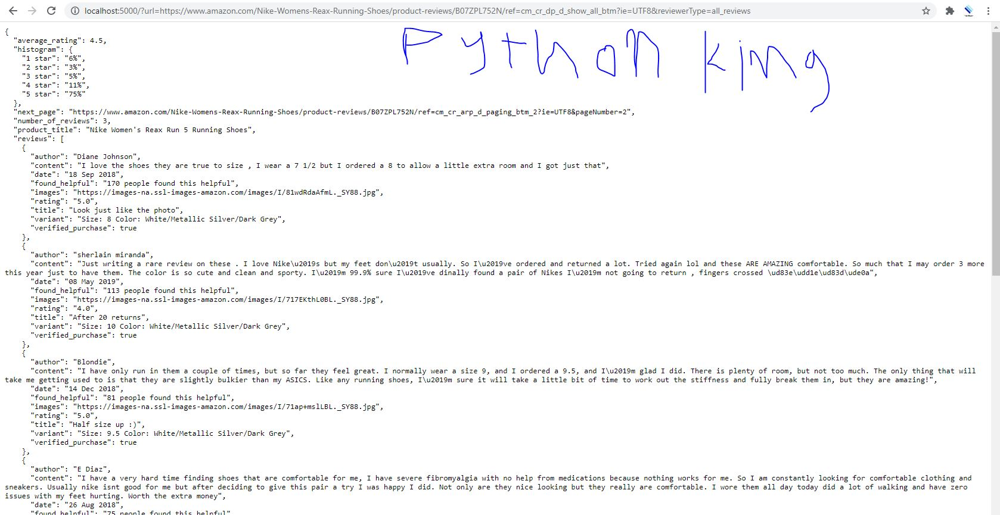

# amazon-legal_scraper

1- amazon kind allow scraping  (using my App Will make you able to scrap proudects reviews for a spacifc url 

1- this will scrap 1 product becuase 1 url given doing it many time in for loop before return the answer
will allow it to scrap more than 1 page + it may take large time (it can take the urls from text file)
2- usefull info https://support.google.com/webmasters/answer/70897?hl=en

# X-Path : (finished-recap)
https://www.w3schools.com/xml/xpath_syntax.asp

https://www.scrapehero.com/python-amazon-reviews-api/

https://www.scrapehero.com/how-to-build-and-run-scrapers-on-a-large-scale/

https://blog.hartleybrody.com/web-scraping-cheat-sheet/

